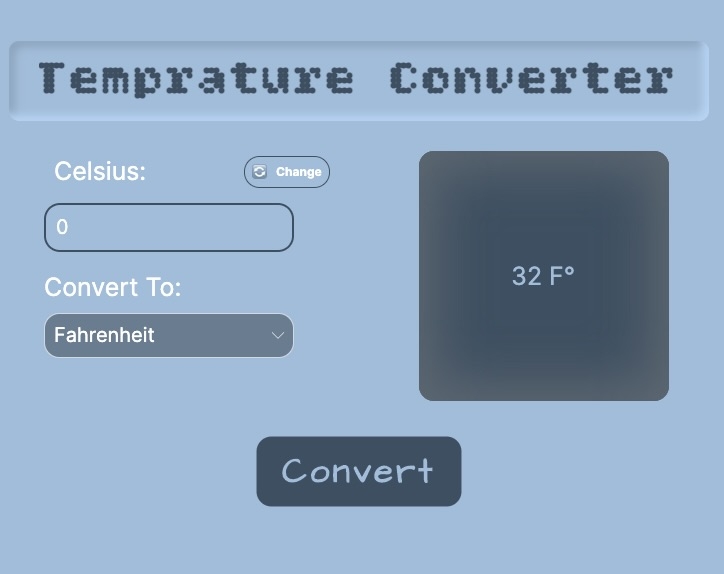

# Temperature Converter

A simple and intuitive temperature conversion application built with **Avalonia UI** and **C#**.

## Overview

Temperature Converter is a desktop application that allows users to easily convert temperatures between different units (Celsius, Fahrenheit, and Kelvin). The application provides a clean, user-friendly interface for quick and accurate temperature conversions.

## Features

- ✨ **Multi-unit Support**: Convert between Celsius, Fahrenheit, and Kelvin
- 🎨 **Clean UI**: Built with Avalonia for a modern, responsive interface
- ⚡ **Real-time Conversion**: Instant results as you type
- 🔄 **Bidirectional**: Convert in any direction
- 💻 **Cross-platform**: Runs on Windows, macOS, and Linux

## Screenshot



## Project Structure

```
TempratureConverter/
├── App.axaml              # Application-level XAML definitions
├── App.axaml.cs           # Application code-behind
├── MainWindow.axaml       # Main window UI definition
├── MainWindow.axaml.cs    # Main window code-behind
├── Program.cs             # Application entry point
├── Services/
│   └── TempConverter.cs    # Core temperature conversion logic
├── Assets/
│   └── Fonts/             # Custom fonts 
└── TempratureConverter.csproj
```

## Getting Started

### Prerequisites

- .NET 10.0 or higher
- Visual Studio Code or Visual Studio 2022+

### Installation

1. Clone the repository:
```bash
git clone <repository-url>
cd TempratureConverter
```

2. Restore dependencies:
```bash
dotnet restore
```

3. Build the project:
```bash
dotnet build
```

### Running the Application

Execute the following command in your terminal:

```bash
dotnet run
```

## Technology Stack

- **Framework**: Avalonia UI 11.x
- **Language**: C# 12
- **.NET**: .NET 10.0
- **Platform**: Cross-platform (Windows, macOS, Linux)

## Usage

1. Launch the application
2. Select the unit you want to convert from
3. Enter the temperature value
4. Select the target unit
5. View the converted result instantly

## Architecture

The application follows a simple architectural pattern:

- **UI Layer**: Avalonia XAML components (MainWindow.axaml)
- **Logic Layer**: Conversion service (TempConverter.cs)
- **Integration**: Code-behind files connecting UI to logic

## Development

### Building for Release

For Windows X64:
```bash
dotnet publish -c Release -r win-x64 --self-contained true -p:PublishSingleFile=true -p:IncludeNativeLibrariesForSelfExtract=true
```

### Project Configuration

The project is configured in `TempratureConverter.csproj` with:
- Target framework: .NET 10.0
- Output type: Desktop application
- Avalonia NuGet packages

## Contributing

Feel free to submit issues and enhancement requests!


## Author

Created as part of university coursework - English C# & Avalonia UI

---

**Last Updated**: April 17, 2026